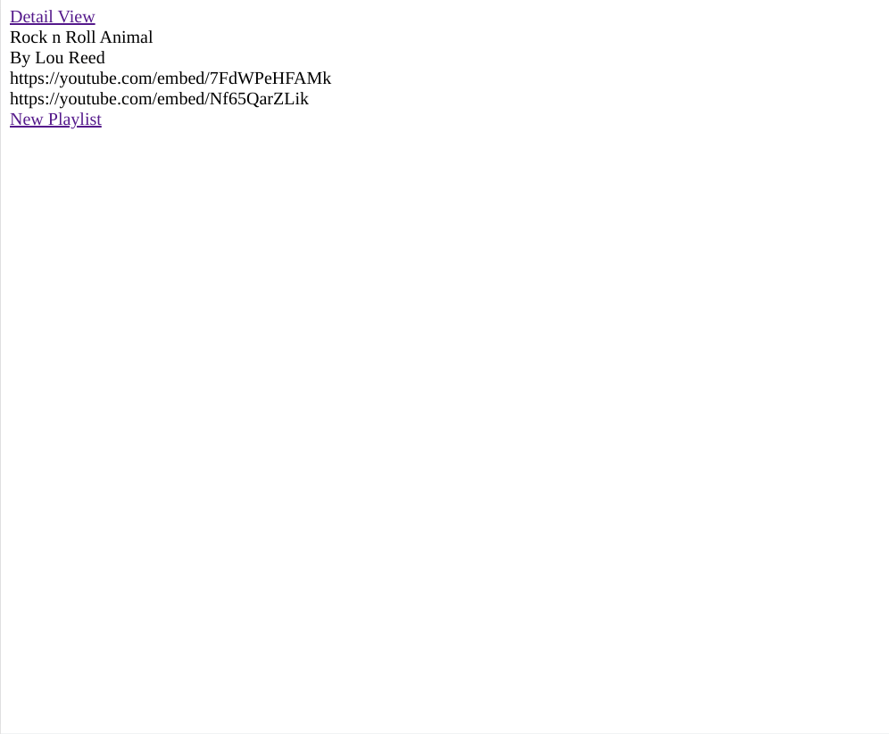
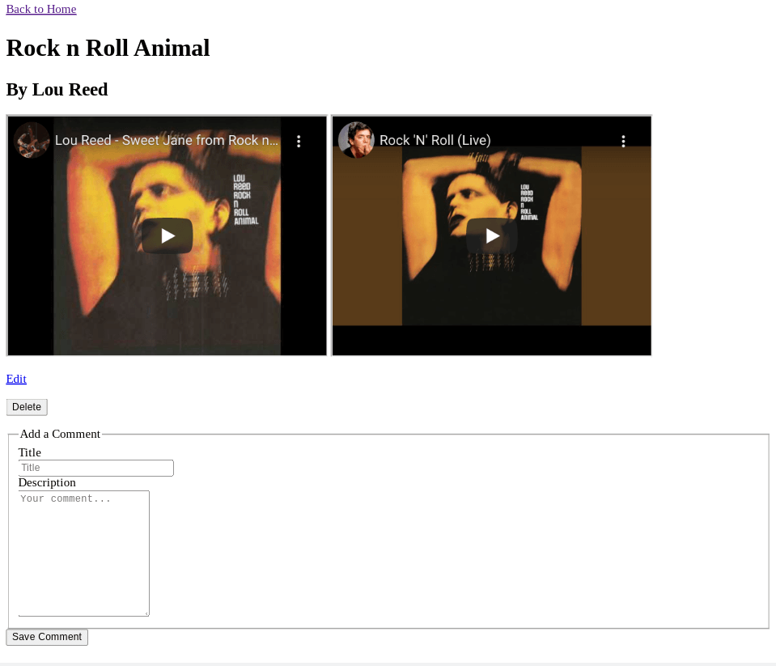
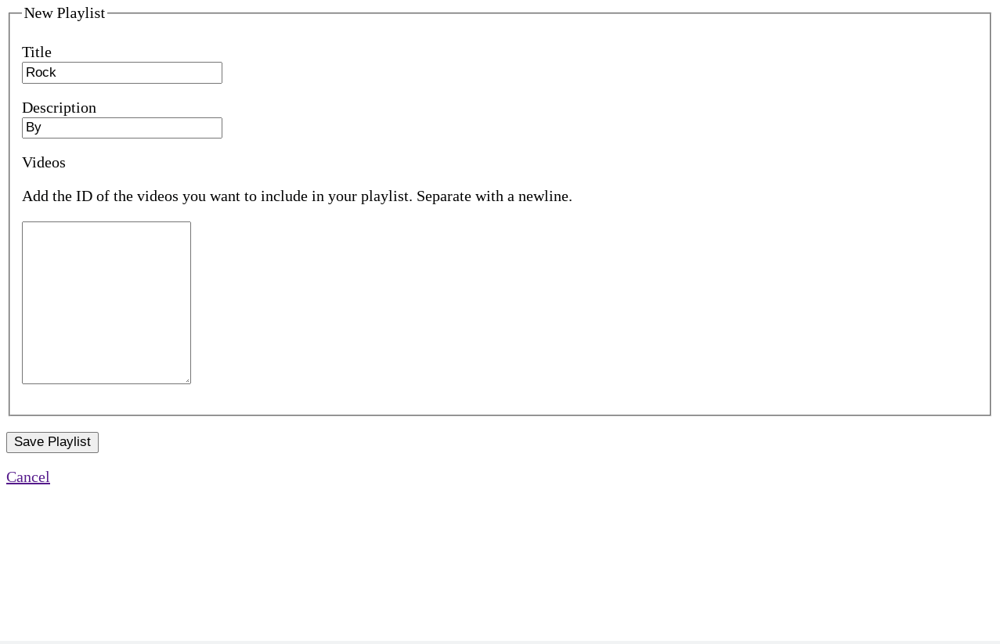

<h1 align="center">Playlister</h1>

   Tutorial from  <a href="https://makeschool.org/mediabook/oa/tutorials/playlistr-video-playlists-with-flask-and-mongodb-1c/start-a-flask-project/" target="_blank">makeschool.org</a>.

## Table of Contents

- [Overview](#overview)
  - [Built With](#built-with)
- [Features](#features)
- [Improvements](#improvements)
- [Useful Resources](#useful-resources)

## Overview

MakeSchool was a coding bootcamp that went under.  Most content was made free and I found this and decided to follow along.

To run, git clone and add a MONGO Connection String.

### Built With

- Express
- Express-Handlebars
- Mongoose

## Features

Save playlists of YouTube videos and add comments to the playlist.   

## Improvements

- Styling
- Authentication
- Subtemplates

### Resources 

- [Mongoose](https://mongoosejs.com/docs/tutorials/virtuals.html#virtuals-with-lean) - Mongoose lean & virtuals
- [Stack Overflow](https://stackoverflow.com/questions/8125709/javascript-how-to-split-newline) - split by newline regex